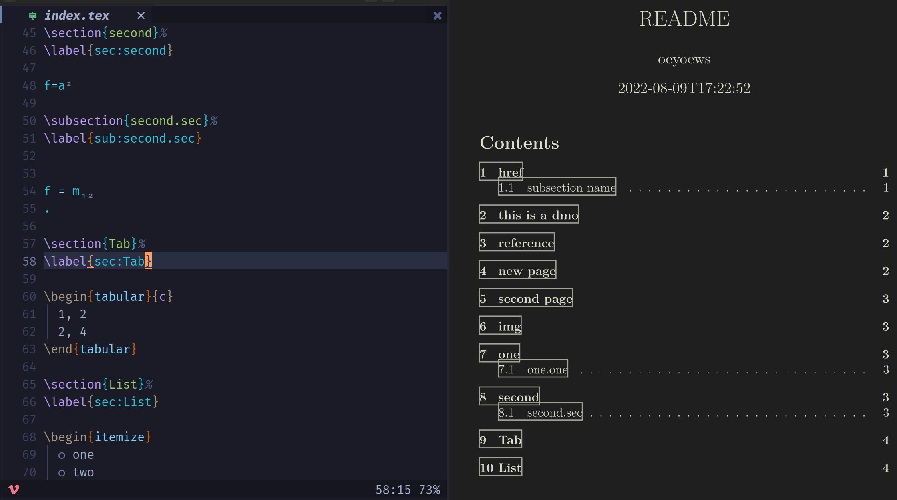
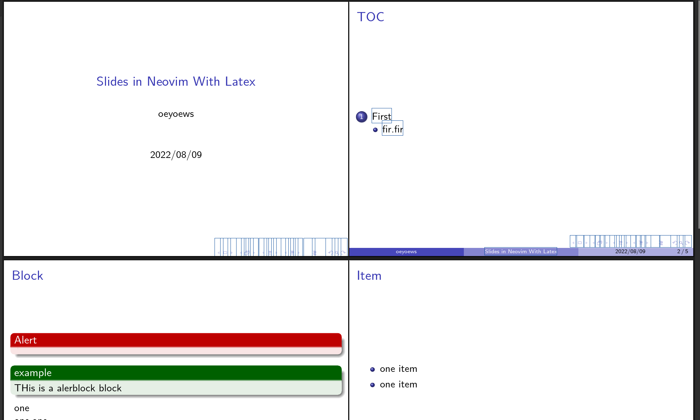
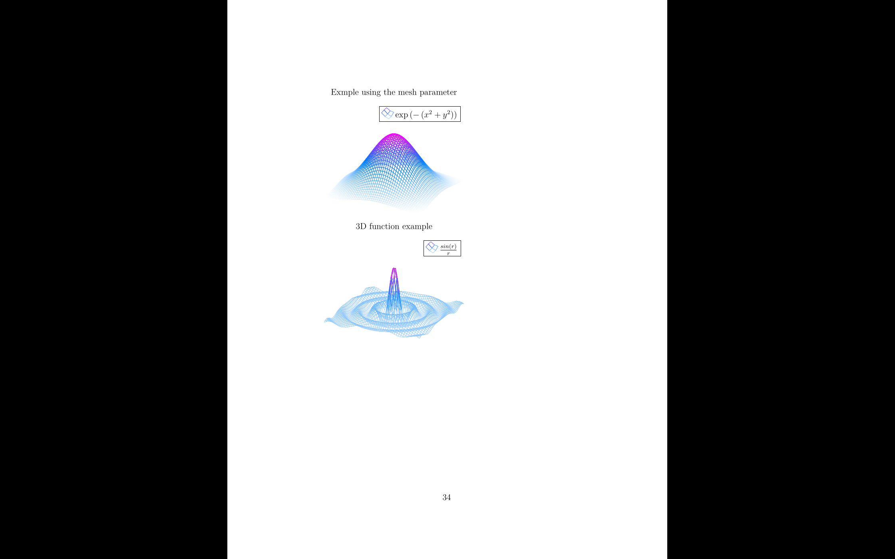
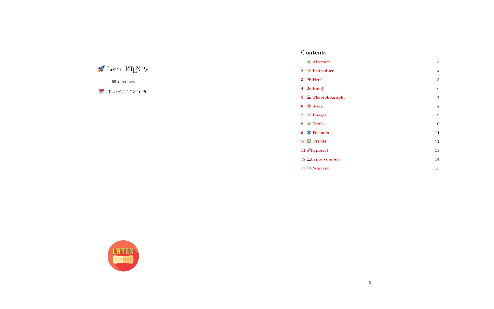

<div align="center">


</div>

<h1 align="center">LaTeX With Neovim</h1>

<div align="center">


</div>

# TOC

<!-- toc -->

- [What's that](#whats-that)
- [Showcases](#showcases)
- [Struct](#struct)
- [Build](#build)
- [Tools](#tools)
- [Links](#links)
- [Bugs](#bugs)
- [Tips](#tips)
- [Tutorials](#tutorials)
- [TODO](#todo)
- [Emoji](#emoji)
- [Preview](#preview)
- [Videos](#videos)
- [Others](#others)

<!-- tocstop -->

## What's that

> 🎊 A LaTeX Project Template for LaTeX beginners with neovim

## Showcases

|  |  |  |
| :----------------------------------------------: | :----------------------------------------------: | ------------------------------------------------ |
|  |  |  |

## Struct

```bash
📂latex
├── 📂docs
├── 📂img
├── 📝main.tex
├── 📝makefile
├── 📝README.md
└── 📂src
```

## Build

```bash
make update # generate pdf
make view # show generated pdf
```

## Tools

- [zathura](https://wiki.archlinux.org/title/zathura) and mupdf-gl base
- vimtex(plugin)
- neovim(vim)
- tex related
- tlmgr
  [tlmgr](http://tug.ctan.org/info/tlmgr-intro-zh-cn/tlmgr-intro-zh-cn.pdf)
- not install ctex by tlmgr, its out of box
- latexmk(increment compile)

## Links

- [install texlive](https://wiki.archlinux.org/title/TeX_Live#Package_documentation)
- [twemoji emojipedia](https://emojipedia.org/twitter/twemoji-14.0/party-popper/)
- [elegant](https://github.com/ElegantLaTeX/)
- [template](https://github.com/Azure1210/elegantbook-magic-revision)
- [report](http://www.ptep-online.com/ctan/lshort_chinese.pdf)
- [development](https://segmentfault.com/a/1190000038145401)
- [official](https://www.latex-project.org/help/documentation/)
- [tutorial](https://nbviewer.org/github/xinychen/latex-cookbook/blob/main/chapter-1/section5.ipynb)
- [tuna](https://github.com/tuna/thuthesis)
- [resume](https://github.com/hijiangtao/resume), [res2](https://github.com/jankapunkt/latexcv)
- [slides](https://github.com/xinychen/awesome-beamer)
- [makefile](https://seisman.github.io/how-to-write-makefile/functions.html)

## Bugs

- tlmgr not founded: [ref](https://wiki.archlinux.org/title/TeX_Live#tlmgr)

## Tips

```bash
latexdiff old.tex mod.tex > diff.tex  && compile diff.tex
```

- [math plot](https://zhuanlan.zhihu.com/p/493767981)
- [tex sctactoverflow](https://tex.stackexchange.com/)
- [pylatex](https://github.com/JelteF/PyLaTeX)
- [symbol](http://detexify.kirelabs.org/classify.html)
- [compile](https://zhuanlan.zhihu.com/p/127737245)
- texlive-langjapanese to fix lua error [ref](https://wiki.archlinux.org/title/TeX_Live/CJK#Missing_or_inconsistent_fonts)
- `textdoc forest` [texdoc](https://texdoc.org/index.html)
- xelatex -> latexmk - zathura(save to refresh)
- latex -pdf # get all pdf
- vimtex(plugin)
- preview(plugin)

## Tutorials

- [bbs](https://www.mysmth.net/nForum/#!board/TeX)
- [learnxinyminutes](https://learnxinyminutes.com/docs/latex/)
- [overleaf](https://www.overleaf.com/learn)
- [basic](https://www.learnlatex.org/en/)
- [docs](https://lvjr.bitbucket.io/tutorial/learn-latex.pdf)
- [latex workspace](https://www.latexstudio.net/archives/5900.html)
- [00](https://evian-zhang.github.io/index.html)
- [tlocalmgr](https://wiki.archlinux.org/title/TeX_Live)
- [mirror](https://mirrors.tuna.tsinghua.edu.cn/help/CTAN/)
- texlive-installer
- [17002](https://castel.dev/post/lecture-notes-2/)

## TODO

[TODO](docs/todo.norg)

## Emoji

- [emoji](https://texdoc.org/serve/emoji/0)
- [font](https://github.com/mozilla/twemoji-colr/releases/tag/v0.6.0)

## Preview

- Update nightly [📑 en && cn](https://github.com/oeyoews/latex/tree/gh-pages)

## Videos

- [v1](https://www.youtube.com/watch?v=M0p0y5sBBCo)

## Others

- [pyluatex](https://github.com/tndrle/PyLuaTeX)
