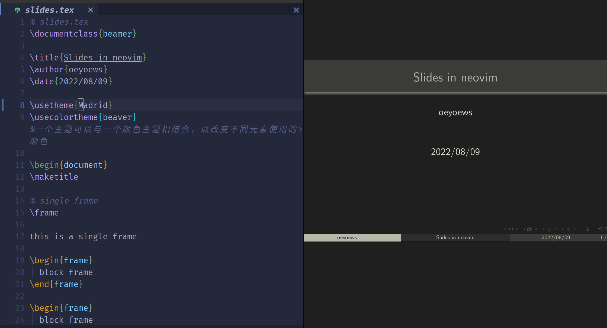
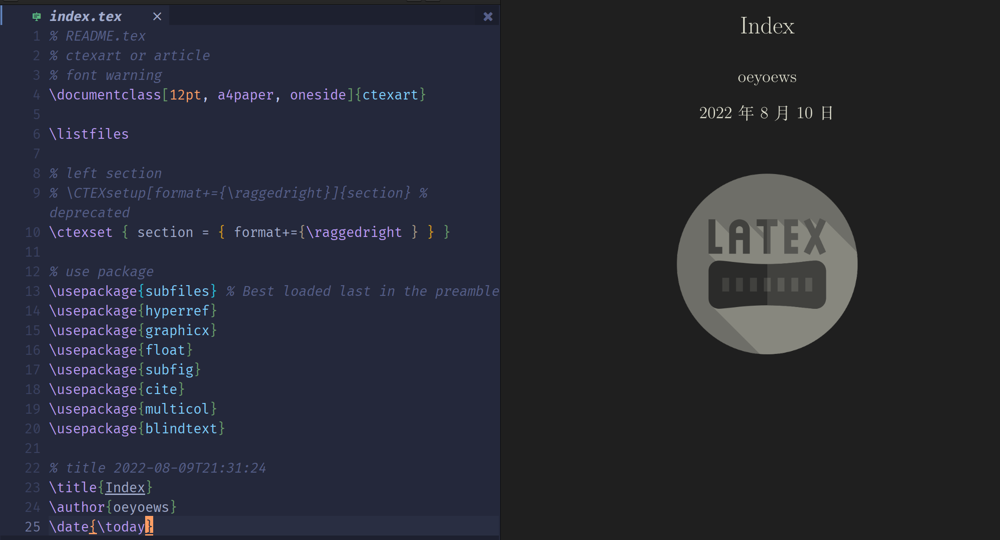

<div align="center">


</div>

<h1 align="center">LatexVim</h1>

<div align="center">


</div>

## What's that

> 🎊 A latex project template

## Showcases

|  |  |  |
| :----------------------------------------------: | :----------------------------------------------: | ------------------------------------------------ |

## Struct

```bash

├── src
├── img
├── public
├── README.md
├── index.tex
└── test # test

```

## Tools

- vimtex(plugin)
- neovim(vim)
- tex related
- zathura(pdf)
- tlmgr
- latexmk(increment compile)

## Links

- [tutorial](https://nbviewer.org/github/xinychen/latex-cookbook/blob/main/chapter-1/section5.ipynb)
- [tuna](https://github.com/tuna/thuthesis)
- [resume](https://github.com/hijiangtao/resume), [res2](https://github.com/jankapunkt/latexcv)
- [slides](https://github.com/xinychen/awesome-beamer)

## Bugs

- tlmgr not founded: [ref](https://wiki.archlinux.org/title/TeX_Live#tlmgr)

## Tips

- xelatex -> latexmk - zathura(save to refresh)
- vimtex(plugin)
- preview(plugin)

## Tutorials

- [latex workspace](https://www.latexstudio.net/archives/5900.html)
- [00](https://evian-zhang.github.io/index.html)
- [tlocalmgr](https://wiki.archlinux.org/title/TeX_Live)
- [mirror](https://mirrors.tuna.tsinghua.edu.cn/help/CTAN/)
- texlive-installer

## TODO

- mupdf zathura different
